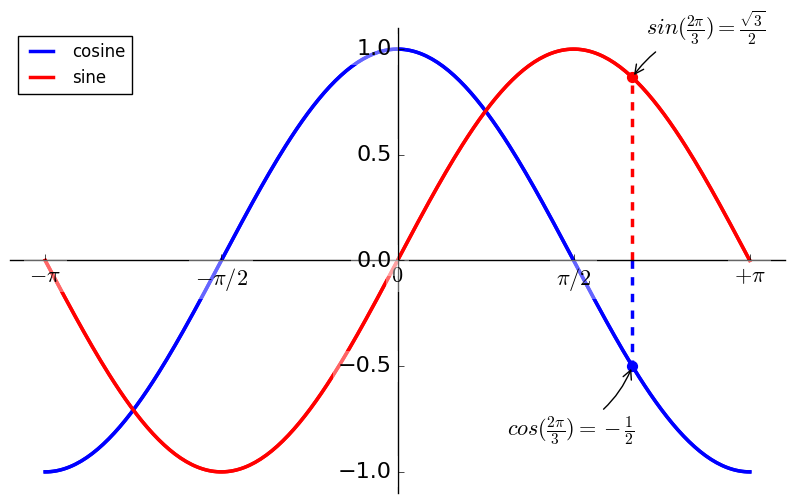

```python
import sys


sys.version
```


    '3.5.2 |Anaconda 4.2.0 (64-bit)| (default, Jul  5 2016, 11:41:13) [MSC v.1900 64 bit (AMD64)]'


```python
import matplotlib.pyplot as plt
import numpy as np


x = np.linspace(-np.pi, np.pi, 256, endpoint=True)
#第一个参数是起始坐标，第二个参数是中点坐标， 第三个参数是分割的段数
c, s = np.cos(x), np.sin(x)
#c, s 分别为x 对应的正弦余弦值
plt.plot(x, c)
plt.plot(x, s)
plt.show()
```


```python
fig = plt.figure(figsize=(10, 6), dpi=80)
plt.plot(x, c, 'b-', lw=2.5)
plt.plot(x, s, 'r-', lw=2.5)
#这里增加了两个参数，'b-' 是 `color="blue",linestyle="-"`的简写形式
#'lw'是'linewidth'， 线宽的简写形式
plt.show()
```


```python
plt.xlim(x.min()*1.1, x.max()*1.1)
plt.ylim(c.min()*1.1, c.max()*1.1)
#这里plt.xlim 和 plt.ylim 分别是 x_limit 和 y_limit
#这个方法用来调整x, y 轴的最大高度，两个参数分别是上限和下限
fig
```


```python
plt.xticks([-np.pi, -np.pi/2, 0, np.pi/2, np.pi])
plt.yticks([-1, 0, 1])
#这里的两个方法xticks, yticks可以修改坐标的标签
#传入一个list对象，坐标轴将只显示list中给出的坐标
fig
```


```python
plt.xticks([-np.pi, -np.pi/2, 0, np.pi/2, np.pi],
           [r'$-\pi$', r'$-\pi/2$',  r'$0$', r'$\pi/2$',r'$+\pi$'])
#这里的xticks方法穿了两个List 作为参数，第一个是显示的数值，第二个是这个数值对应的别名
#其中第二个参数会按照第一个参数的个数n取前n个
#第二个list的内容前后应该有'$'符号
fig
```


```python
fig = plt.figure(figsize=(10, 6), dpi=80)

ax=plt.gca()
ax.spines['right'].set_color('none')
ax.spines['top'].set_color('none')
#这里把右边和上边的边界设置为不可见
ax.xaxis.set_ticks_position('bottom')
ax.spines['bottom'].set_position(('data', 0))
ax.yaxis.set_ticks_position('left')
ax.spines['left'].set_position(('data', 0))
#把下边界和左边界移动到0点
plt.xticks([-np.pi, -np.pi/2, 0, np.pi/2, np.pi],
           [r'$-\pi$', r'$-\pi/2$',  r'$0$', r'$\pi/2$',r'$+\pi$'])
plt.xlim(x.min()*1.1, x.max()*1.1)
plt.ylim(c.min()*1.1, c.max()*1.1)

plt.plot(x, c, 'b-',lw=2.5)
plt.plot(x, s, 'r-',lw=2.5)
fig
```


```python
plt.plot(x, c, 'b-', lw=2.5, label='cosine')
plt.plot(x, s, 'r-', lw=2.5, label='sine')
plt.legend(loc='upper left')
#这里又增加了一个参数 label是线的标签
#plt.legend方法给标签设置位置 ,其中loc字段可选
'''
	lower right
	center right
	upper right
	right
	upper center
	lower left
	lower center
	center left
	center
	best
	upper left
'''
fig
```


```python
t = 2*np.pi/3

plt.plot([t,t],[0,np.cos(t)], color ='blue', linewidth=2.5, linestyle="--")
plt.scatter([t,],[np.cos(t),], 50, color ='blue') #画出需要标注的点
plt.annotate(r'$sin(\frac{2\pi}{3})=\frac{\sqrt{3}}{2}$',
         xy=(t, np.sin(t)), xycoords='data',
         xytext=(+10, +30), textcoords='offset points', fontsize=16,
         arrowprops=dict(arrowstyle="->", connectionstyle="arc3,rad=.2")) 
#给这个点添加注释，下同

plt.plot([t,t],[0,np.sin(t)], color ='red', linewidth=2.5, linestyle="--")
plt.scatter([t,],[np.sin(t),], 50, color ='red')
plt.annotate(r'$cos(\frac{2\pi}{3})=-\frac{1}{2}$',
         xy=(t, np.cos(t)), xycoords='data',
         xytext=(-90, -50), textcoords='offset points', fontsize=16,
         arrowprops=dict(arrowstyle="->", connectionstyle="arc3,rad=.2"))
#annotate 参数中比较需要注意的一点就是数学表达式的书写
fig
```


```python
for label in ax.get_xticklabels() + ax.get_yticklabels():
    label.set_fontsize(16)
    label.set_bbox(dict(facecolor='w', edgecolor='None',alpha=0.4))
fig
```





